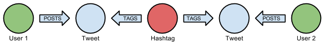

## Setup
```{r install_pkg, eval=FALSE}
install.packages("devtools")
devtools::install_github("nicolewhite/RNeo4j")
```

## Launch Database
```{r launch}
setwd("~/Neo4j/Twitter/omicsGraph")
suppressMessages(require(igraph))
suppressMessages(require(RNeo4j))
graph = startGraph("http://localhost:2794/db/data/")
graph$version
```

## Constructing the query
Users are connected if they've tweeted the same hashtag.
Edges are weighted by how many times the users have tweeted the same hashtag.
Undirected.



where, the hashtags name `h.name` *should not be* `<>` "metagenomics", "rnaseq" and "omics", since we've only downloaded these tweets.

```{r query,cache=FALSE}
query = "
MATCH (u1:User)-[:POSTS]->(:Tweet)<-[:TAGS]-(h:Hashtag)-[:TAGS]->(:Tweet)<-[:POSTS]-(u2:User)
WHERE h.name <> 'rnaseq' AND h.name <> 'metagenomics' AND (ID(u1) < ID(u2))
RETURN u1.screen_name, u2.screen_name, COUNT(*) AS weight
"
```

\newpage

### Execute the query and present the result
```{r output, echo=TRUE, cache=FALSE}
data = cypher(graph, query)
head(data)
```

### Convert data frame to graph data frame
```{r graph}
g = graph.data.frame(data, directed = F)
```

### Remove text labels and plot.
```{r pretty1}
V(g)$label = NA
V(g)$size = 4
V(g)$color = "cyan"
plot(g)
```

\newpage

### Top 5 betweenness.
```{r top5}
sort(betweenness(g), decreasing = T)[1:5]
```

### Make size of node a function of its betweenness.
```{r between}
V(g)$size = betweenness(g) / (max(betweenness(g)) * .1)
plot(g)
```

\newpage

### Clustering.
```{r cluster}
cluster = edge.betweenness.community(g)$membership

colors = rainbow(max(cluster))
colors = colors[sample(length(colors))]

V(g)$color = colors[cluster]
V(g)$size = 4
plot(g)
```
